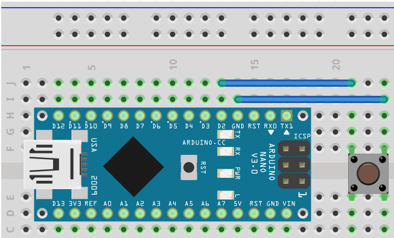

# KK-Switch
## Introduction
A library for handling any kinds of digital inputs from switches, push buttons, rotary encoders and a lot of other devices. Several options are offered for an easy and performant handling.

The main target was to get an easy understandable code and the chance to concentrate on the real functionality of the project. All functionality for the digital inputs is encapsulated in a separate class and only changes of the input need attention.

Different digital inputs can be handled completely independent in parallel with Switch objects and the raw digital inputs and the resulting outputs are named „states“ of a switch.

Advantages

    • no active waits
    • high performance
    • low memory usage
    • handling current and previous state
    • state caching enables stable state analysis
    • easy handling in loops with little code
    • state mapping (optional)
    • negative input pin logic (optional)
    • software debouncing (optional)
    • reduction of raw state reads (optional)
    • sequence analysis (optional)
    • raw input state change via interrupt possible (with HW debouncing)
    • easy alternative to callback functions available
    • sequence analysis available for push buttons and rotary encoders (optional)
    • push button events like single, double, long single and long repeat available (optional)

## Installation
The library can be installed via Arduino Library Manager or by downloading the [archive](library/KK-Switch.zip) from directory „library“ and unpacking the archive in IDEs libraries directory.

## Getting started
Prerequisite is the following electrical configuration.


Only a few lines of code are necessary to understand the logic behind:
```
#include <Switch.h>
#define INPUT_PIN 2

// use 2 states, no mapping, pin 2, no read wait, debouncing, negative logic
Switch sw = Switch(2, false, INPUT_PIN, 0, 20, true);

void setup() {

  sw.configurePin();

}

void loop() {
  if(sw.hasChanged()){
    // do what you want, whenever the digital signal changes
  }
}
```
See the complete list of examples in the examples folder and in the [documentation](doc/LibraryDoc_KK-Switch.pdf).

